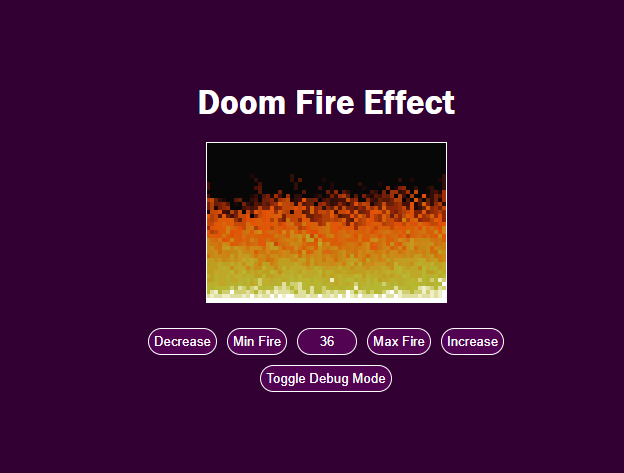

<h1 align="center">Doom Fire</h1>

 <a href="#description">Project Description</a> •
 <a href="#instalation">Instalation</a> • 
 <a href="#technologies">Tecnologies</a> • 
 <a href="#autor">Author</a> • 
 <a href="#images">Images</a>

## 💻 Project Description

 Doom fire is a project based in Filipe Deschamps's project that recreates the algorithm used in the game Doom in a simple Way. The first implementation was done as it was done in the video, but a step further is the second implementation that uses a bidimensional array in javascript or a Array of arrays.

Filipe Deschamps - Doom Fire -  [Video](https://www.youtube.com/watch?v=fxm8cadCqbs) [Repo](https://github.com/filipedeschamps/doom-fire-algorithm)

## 📦 Instalation

### Prerequisites
It is a simple webpage, you can clone the project or in your computer and run in the browser or run a tool like Live Server of Visual Studio Code.
You can also just access the online version through GitHub Pages
Antes de começar, você vai precisar ter instalado em sua máquina as seguintes ferramentas:

[Git](https://git-scm.com)

## 🛠 Tecnologies

The following resources are used in this project

- [Javascript](https://developer.mozilla.org/pt-BR/docs/Web/JavaScript)

## 👨‍💻 Autor
<a href="https://www.linkedin.com/in/ikaroamorimesilva/">
 
  
 <b>Ikaro Amorim e Silva</b>
 </a>

Done with ❤️ by Ikaro Amorim e Silva

  

## 🌍 Images and Videos

   

